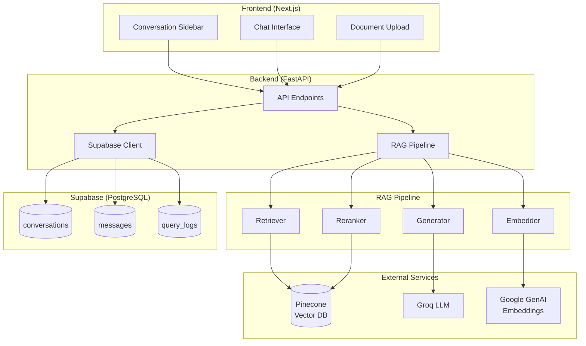

# RAG System with Pinecone, Groq & BGE Reranker

A complete Retrieval-Augmented Generation (RAG) system with inline citations, evaluation framework, and **persistent conversation storage via Supabase**.

## Features

- **Vector Database**: Pinecone (hosted, serverless)
- **Embedding**: Google GenAI gemini-embedding-001 (3072-dim)
- **Reranker**: Pinecone Inference API with BGE-reranker-v2-m3
- **LLM**: Groq (llama-3.3-70b-versatile)
- **Frontend**: Next.js with Tailwind CSS
- **Conversation Storage**: Supabase (PostgreSQL) with MCP support
- **Evaluation**: Dynamic QA generation with precision, recall, and success rate metrics

## Architecture



## Quick Start

### 1. Setup Environment

```bash
# Create and activate virtual environment
python -m venv venv
venv\Scripts\activate  # Windows
# source venv/bin/activate  # Linux/Mac

# Install dependencies
pip install -r requirements.txt
```

### 2. Configure API Keys

Create a `.env` file in the root directory:

```env
# Core Services
PINECONE_API_KEY=your_pinecone_api_key_here
GROQ_API_KEY=your_groq_api_key_here
GOOGLE_API_KEY=your_google_api_key_here
PINECONE_INDEX_NAME=rag-documents

# Supabase (Optional - for conversation persistence)
SUPABASE_URL=https://your-project.supabase.co
SUPABASE_ANON_KEY=your_supabase_anon_key_here
```

### 3. Setup Supabase (Optional)

To enable persistent conversation storage:

1. Create a free project at [supabase.com](https://supabase.com)
2. Go to **Settings → API** and copy your Project URL and anon key
3. Run the schema in **SQL Editor**:
   ```sql
   -- Copy contents of supabase_schema.sql and run in Supabase SQL Editor
   ```

### 4. Start Backend

```bash
uvicorn backend.main:app --reload
```

Backend runs at: http://localhost:8000

### 5. Start Frontend

```bash
cd frontend
npm install
npm run dev
```

Frontend runs at: http://localhost:3000

## API Endpoints

### Core Endpoints

| Endpoint | Method | Description |
|----------|--------|-------------|
| `/health` | GET | Health check with index stats & Supabase status |
| `/index` | POST | Index a document |
| `/query` | POST | Query with RAG pipeline |
| `/stats` | GET | Get index statistics |
| `/eval-document` | POST | Generate QA pairs and evaluate on a document |

### Conversation Endpoints (Supabase)

| Endpoint | Method | Description |
|----------|--------|-------------|
| `/conversations` | GET | List all conversations |
| `/conversations` | POST | Create new conversation |
| `/conversations/{id}` | GET | Get conversation with messages |
| `/conversations/{id}` | PATCH | Update conversation title |
| `/conversations/{id}` | DELETE | Delete conversation |
| `/conversations/{id}/messages` | POST | Send message & get RAG response |

### Example: Index Document

```bash
curl -X POST http://localhost:8000/index \
  -H "Content-Type: application/json" \
  -d '{"text": "Your document content...", "title": "Document Title"}'
```

### Example: Query

```bash
curl -X POST http://localhost:8000/query \
  -H "Content-Type: application/json" \
  -d '{"query": "What is machine learning?"}'
```

### Example: Create Conversation & Send Message

```bash
# Create conversation
curl -X POST http://localhost:8000/conversations \
  -H "Content-Type: application/json" \
  -d '{"title": "My Research"}'

# Send message (replace {id} with conversation ID)
curl -X POST http://localhost:8000/conversations/{id}/messages \
  -H "Content-Type: application/json" \
  -d '{"query": "Explain neural networks"}'
```

## Project Structure

```
PreduskAssignment/
├── backend/
│   ├── config.py           # Configuration settings
│   ├── embedder.py         # Google GenAI embedding
│   ├── chunker.py          # Document chunking
│   ├── indexer.py          # Pinecone indexing
│   ├── retriever.py        # Vector retrieval
│   ├── reranker.py         # Pinecone BGE reranker
│   ├── generator.py        # Groq LLM generation
│   ├── supabase_client.py  # Supabase conversation storage
│   └── main.py             # FastAPI app
├── frontend/
│   └── src/app/
│       └── page.tsx        # Main UI with conversation sidebar
├── eval/
│   └── ...                 # Evaluation framework
├── supabase_schema.sql     # Database schema for Supabase
├── requirements.txt
├── .env.example
└── README.md
```

## Evaluation

Run evaluation on any document:

1. Paste document text in the UI
2. Click "Eval on Doc"
3. System generates 5 QA pairs and evaluates RAG responses

**Metrics:**
- **Precision**: Relevant keywords found / Expected keywords
- **Recall**: Relevant keywords found / Expected keywords  
- **Success Rate**: Questions answered correctly / Total questions

## Technical Reference

### Pinecone Configuration

| Parameter | Value | Description |
|-----------|-------|-------------|
| **Index Name** | `rag-documents` | Default index name (configurable) |
| **Dimension** | `3072` | Matches `gemini-embedding-001` output |
| **Metric** | `cosine` | Similarity metric for retrieval |
| **Cloud/Region** | `aws/us-east-1` | Free tier compatible |
| **Reranker** | `bge-reranker-v2-m3` | Reranks top-10 results to top-5 |

### Supabase Schema

The system logs conversations and analytics to the following tables (see `supabase_schema.sql`):

#### 1. `conversations`
Stores chat sessions.
- `id` (UUID): Primary key
- `title` (TEXT): Auto-generated from first message
- `created_at`: Timestamp

#### 2. `messages`
Stores individual chat messages.
- `conversation_id` (UUID): Foreign key to conversations
- `role` (TEXT): 'user' or 'assistant'
- `content` (TEXT): Message text
- `citations` (JSONB): Inline citations used in response
- `token_usage` (JSONB): Metadata on token stats

#### 3. `query_logs` (Analytics)
Logs every query (homepage & chat) for analysis.
- `query` (TEXT): User question
- `answer` (TEXT): System response
- `has_answer` (BOOLEAN): If relevant info was found
- `timing_ms` (FLOAT): Latency
- `sources_used` (INT): Number of documents referenced

## License

MIT
